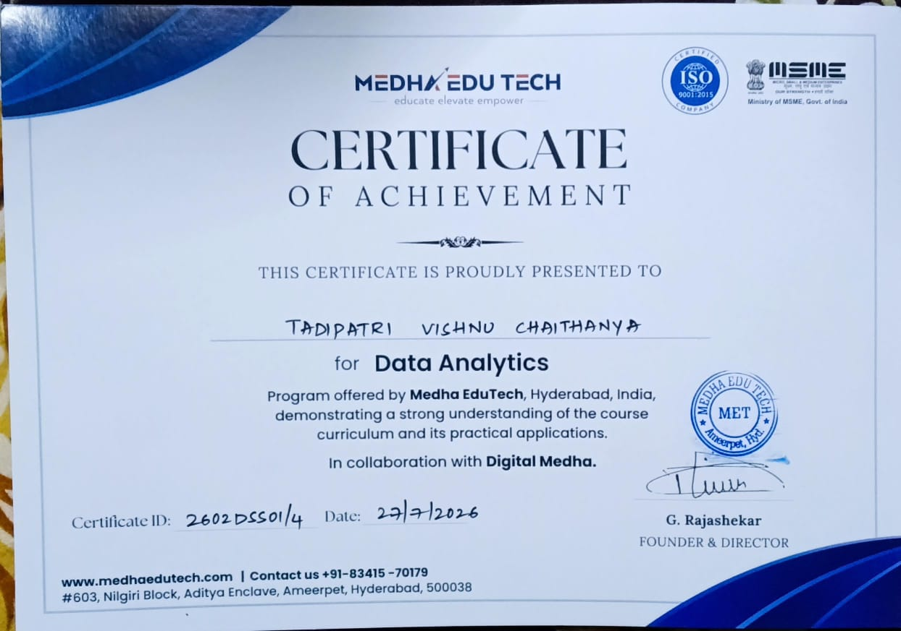
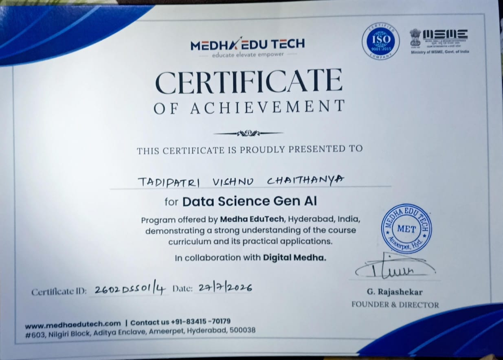
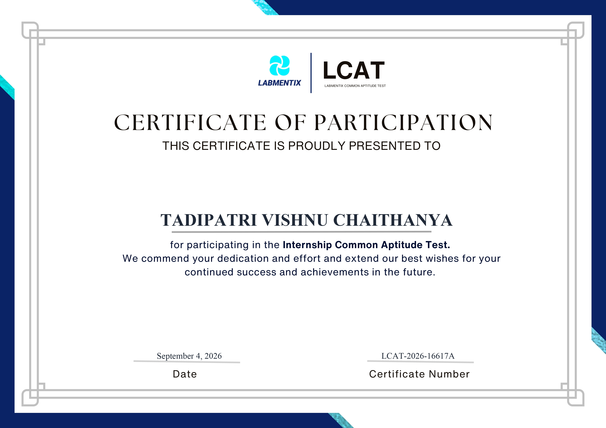

<div align="center">


[](https://git.io/typing-svg)

<br/>

<a href="https://www.linkedin.com/in/tadipatri-vishnu-chaithanya-52817037b" target="_blank">
  
</a>
<a href="https://github.com/vishnu-chaithanya-ds" target="_blank">
  
</a>
<a href="https://vishnuchaithanya.netlify.app/" target="_blank">
  
</a>
<a href="mailto:tadipatrivishnuchaithanya@gmail.com">
  
</a>

<br/><br/>


</div>

---

## 🙋‍♂️ About Me

```python
class VishnuChaithanya:
    def __init__(self):
        self.name       = "Tadipatri Vishnu Chaithanya"
        self.role       = "Data Analyst | Aspiring Data Scientist"
        self.education  = "B.Tech CSE (AI & ML) | A1 Global Institute of Engineering & Technology (JNTUK)"
        self.cgpa       = 7.5
        self.location   = "Anantapur, Andhra Pradesh, India 🇮🇳"
        self.email      = "tadipatrivishnuchaithanya@gmail.com"
        self.portfolio  = "https://vishnuchaithanya.netlify.app/"

    def strengths(self):
        return [
            "📊 Interactive dashboards with Power BI (DAX, Power Query)",
            "🤖 End-to-end Machine Learning pipelines with Scikit-Learn",
            "🐍 Data analysis with Python, Pandas & SQL",
            "🧠 Generative AI & Deep Learning fundamentals",
        ]

    def career_goal(self):
        return """
        Secure an entry-level role or internship in Data Analytics / Data Science,
        gain industry experience, and grow into a skilled data professional.
        """

me = VishnuChaithanya()
```

- 🎓 **B.Tech — CSE (AI & ML)** at A1 Global Institute of Engineering & Technology *(JNTUK Affiliated)* · CGPA: 7.5
- 📊 I turn **raw data into actionable business insights**
- 💻 Skilled in **Python · SQL · Power BI · Machine Learning · Statistics**
- 🏗️ I build projects that show **real-world analytical problem-solving**
- 📫 Reach me at **tadipatrivishnuchaithanya@gmail.com**
- 🌐 See more on my **[Portfolio](https://vishnuchaithanya.netlify.app/)**

---

## 📈 Impact at a Glance

<div align="center">


</div>

---

## 🛠️ Tech Stack & Skills

| Area | Tools |
|:---|:---|
| **💻 Languages** |    |
| **📊 Analytics & Visualization** |      |
| **🤖 Machine Learning** |   |
| **🗄️ Databases** |   |
| **🔧 Tools & Platforms** |      |
| **📐 Statistics** | Probability · Hypothesis Testing · Statistical Analysis |

---

## 🚀 Featured Projects

### 📊 Data Analytics & BI Projects

<div align="center">
<table>
<tr>
<td width="50%" valign="top">

<a href="https://github.com/vishnu-chaithanya-ds/superstore-sales-dashboard"></a>

### 📈 Superstore Sales Dashboard

> Interactive Power BI dashboard analyzing Superstore sales across regions, states, and product categories.

**✅ Highlights:**
- 💰 Total Sales: **$2.93M** · Profit: **$292.45K** · Margin: **10%**
- 🚀 YoY Sales Growth: **52.96%** across 2023–2025
- 🗺️ Geographic map — US State sales distribution
- 📊 Top subcategory: **Machines ($0.60M)**
- 🎛️ Interactive Region & Year slicers
- 📑 4 pages — Sales · Deep Dive · Customer · Insights

**🔧 Stack:** Power BI · DAX · Power Query · Bing Maps

</td>
<td width="50%" valign="top">

<a href="https://github.com/vishnu-chaithanya-ds/tesla-ev-analytics-dashboard"></a>

### ⚡ Tesla EV Analytics Dashboard

> Interactive Power BI dashboard analyzing Tesla EV deliveries, production, market share, and CO₂ impact across all models and regions from 2015 to 2025.

**✅ Highlights:**
- 🚗 Total Deliveries: **26M** · Production: **28M**
- 💰 Avg Selling Price: **$84.91K** · CO₂ Saved: **1.96M tons**
- 🏆 Top Model: **Model S (5.4M)** · Top Region: **Middle East (6.7M)**
- 🚀 YoY delivery trend analysis across **2015–2025**
- 🎛️ Interactive Year · Region · Model slicers
- 🎥 Includes full screen recording demo

**🔧 Stack:** Power BI · DAX · Power Query · CSV Dataset

</td>
</tr>
</table>
</div>

<br/>

### 🤖 Machine Learning Projects

<div align="center">
<table>
<tr>
<td width="33%" valign="top">

<a href="https://github.com/vishnu-chaithanya-ds/selling-price-of-vehicles"></a>

### 🚗 Vehicle Price Prediction

> Regression model predicting vehicle selling prices from historical transaction data.

**✅ Highlights:**
- 🔍 Data cleaning, EDA & Winsorizer outlier treatment
- 🎯 Ridge Regression tuned with GridSearchCV
- 📉 Evaluated via MSE, R² Score & 5-Fold CV

**🔧 Stack:** Python · Pandas · Scikit-Learn · Seaborn · feature-engine

**⚙️ Algorithms:** `Linear Regression` · `Ridge Regression`

</td>
<td width="33%" valign="top">

<a href="https://github.com/vishnu-chaithanya-ds/predicting-next-day-rainfall"></a>

### 🌧️ Rainfall Prediction

> Binary classifier predicting next-day rainfall from 10 years of Australian weather data.

**✅ Highlights:**
- 🗓️ Feature engineering — Date split into Year/Month/Day
- ⚙️ Outlier treatment: Winsorize, Clipping, Top-Coding
- 📈 Accuracy, Null Accuracy & Overfitting check

**🔧 Stack:** Python · NumPy · Scikit-Learn · category_encoders

**⚙️ Algorithm:** `Logistic Regression (liblinear)`

</td>
<td width="33%" valign="top">

<a href="https://github.com/vishnu-chaithanya-ds/car-evaluation"></a>

### 🚙 Car Evaluation

> Decision Tree model classifying car acceptability from key vehicle attributes.

**✅ Highlights:**
- 🔢 Ordinal Encoding on all categorical features
- 🌳 Decision Tree trained with Gini Index (`max_depth=3`)
- ✅ No overfitting — train 78.5% vs test 80.5% accuracy

**🔧 Stack:** Python · Pandas · Scikit-Learn · category_encoders

**⚙️ Algorithm:** `Decision Tree Classifier (Gini Index)`

</td>
</tr>
</table>
</div>

<br/>

### 🐍 Python Repositories

<div align="center">

<a href="https://github.com/vishnu-chaithanya-ds/python-fundamentals"></a>
<a href="https://github.com/vishnu-chaithanya-ds/python-learning"></a>

</div>

---

## 🏅 Certifications

<div align="center">

<table>
<tr>
<td width="33%" align="center" valign="top">
<a href="assets/Medha_Data_Analytics.jpg"></a>
<br/><b>Data Analytics</b><br/><sub>Certificate of Achievement<br/>Medha EduTech · Jul 2026</sub>
</td>
<td width="33%" align="center" valign="top">
<a href="assets/Medha_Data_Science_GenAI.jpg"></a>
<br/><b>Data Science &amp; Gen AI</b><br/><sub>Certificate of Achievement<br/>Medha EduTech · Jul 2026</sub>
</td>
<td width="33%" align="center" valign="top">
<a href="assets/LCAT_Certificate.jpg"></a>
<br/><b>Labmentix Common Aptitude Test</b><br/><sub>Certificate of Participation<br/>Labmentix · Sep 2026</sub>
</td>
</tr>
</table>

<sub>Click any certificate to view it in full size.</sub>

</div>

<br/>

| 🏅 Certification | Issued by | Date | Credential ID |
|:---|:---:|:---:|:---:|
| **Data Analytics**<br/><sub>Certificate of Achievement, in collaboration with Digital Medha</sub> | Medha EduTech, Hyderabad<br/><sub>ISO 9001:2015 · MSME registered</sub> | 27 Jul 2026 | `2602DSS01/4` |
| **Data Science & Gen AI**<br/><sub>Certificate of Achievement, in collaboration with Digital Medha</sub> | Medha EduTech, Hyderabad<br/><sub>ISO 9001:2015 · MSME registered</sub> | 27 Jul 2026 | `2602DSS01/4` |
| **Labmentix Common Aptitude Test (LCAT)**<br/><sub>Certificate of Participation, Internship Common Aptitude Test</sub> | Labmentix | 4 Sep 2026 | `LCAT-2026-16617A` |

---

## 🎓 Education

🎓 **Bachelor of Technology (B.Tech), Computer Science & Engineering (AI & ML)**
🏛️ A1 Global Institute of Engineering and Technology, Markapuram, Andhra Pradesh (JNTUK Affiliated)
📅 09/2022 – 04/2026 &nbsp;·&nbsp; ⭐ **CGPA: 7.5**

---

## 📊 GitHub Analytics

<div align="center">


<br/>


<br/>


<br/><br/>


</div>

---

## 🎯 Currently Focused On

| Focus | What I'm building |
|:---|:---|
| 📊 **Advanced SQL** | Joins, window functions, CTEs, query optimization |
| 📈 **Power BI & DAX** | Advanced measures and storytelling reports |
| 🤖 **ML Pipelines** | End-to-end modelling, evaluation, deployment basics |
| 🧠 **Deep Learning & Gen AI** | Neural networks with TensorFlow, Generative AI fundamentals |

---

## 🤝 Open to Opportunities

<div align="center">

| 💡 Area | 📋 Details |
|:---:|:---|
| 💼 **Jobs & Internships** | Entry-level Data Analyst / Data Science roles |
| 🌍 **Open Source** | Contributing to data science & analytics tools |
| 👥 **Freelance** | Data analysis, visualization & reporting projects |

</div>

---

## 📬 Connect With Me

<div align="center">

<a href="https://www.linkedin.com/in/tadipatri-vishnu-chaithanya-52817037b" target="_blank">
  
</a>
&nbsp;
<a href="mailto:tadipatrivishnuchaithanya@gmail.com">
  
</a>
&nbsp;
<a href="https://vishnuchaithanya.netlify.app/" target="_blank">
  
</a>
&nbsp;
<a href="https://github.com/vishnu-chaithanya-ds" target="_blank">
  
</a>

<br/><br/>

> *"Without data, you're just another person with an opinion." — W. Edwards Deming*

</div>

---


<div align="center">
  <sub>Made with ❤️ by Vishnu Chaithanya</sub>
</div>
